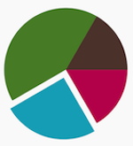
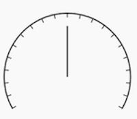
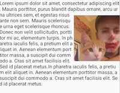
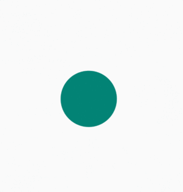
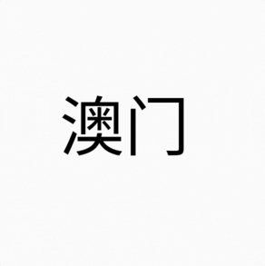

# 自定义view

## 图形的位置和尺寸测量
**PieView**

**DashBoardView**

## Xfermode(transfer)
**AvatarView**

**XfermodeView**

## 文字测量
**SportView**

**MultilineTextView**

## 范围裁切和几何变换
**CameraView-底部翻转**

**CameraView-斜翻转**

## 属性动画和硬件加速
**ViewPropertyAnimator-自带简单动画**

**ObjectAnimator-缩放**

**AnimatorSet-翻转**

**PropertyValuesHolder-翻转**

**PropertyValuesHolder-Keyframe**

**TypeEvaluator**

**TypeEvaluator-custom**

## Bitmap & Drawable
**DrawableView**

## MeterialEditText

